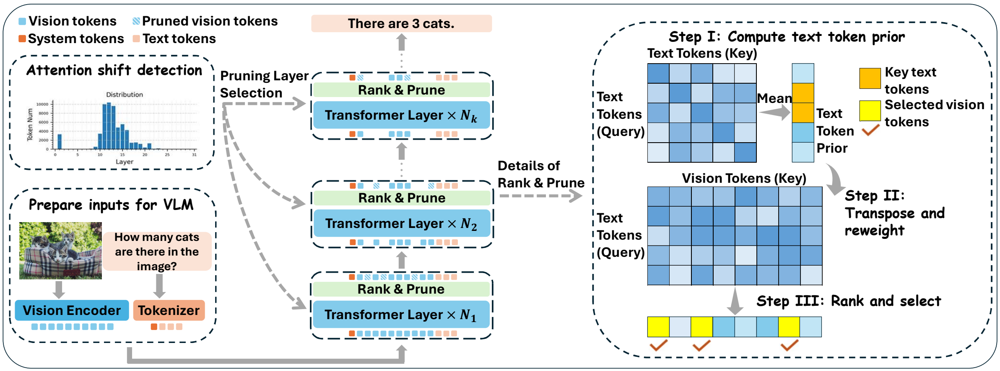

<div align="center">

<h1>AdaptInfer: Adaptive Token Pruning for Vision-Language Model Inference via Dynamical Text Guidance</h1>

<strong>Weichen Zhang</strong><sup>1,2,‡</sup>, <strong>Zhui Zhu</strong><sup>2,‡</sup>, <strong>Ningbo Li</strong><sup>2,3</sup>, <strong>Shilong Tao</strong><sup>4</sup>, <strong>Hongzi Zhu</strong><sup>5</sup>, <strong>Jingao Xu</strong><sup>1</sup>, <strong>Kebin Liu</strong><sup>2,✉</sup>, <strong>Yunhao Liu</strong><sup>2</sup>

<sup>1</sup>The University of Hong Kong · <sup>2</sup>Tsinghua University<br>
<sup>3</sup>The Hong Kong University of Science and Technology · <sup>4</sup>Peking University · <sup>5</sup>Shanghai Jiao Tong University

‡ Co-first authors (equal contribution). ✉ Corresponding author.

</div>

## Overview



**The architecture of AdaptInfer.**

## Installation

The environment targets Linux x86_64 with an NVIDIA GPU, CUDA 12.1, and Python 3.10.
Run the following commands from the repository root:

```bash
conda env create -f environment.yml
conda activate AdaptInfer
pip install flash-attn==2.3.3 --no-build-isolation
```

The Conda environment installs the dependencies in [requirements.txt](requirements.txt).
FlashAttention is installed separately after PyTorch. A CUDA toolkit with `nvcc` is needed when building FlashAttention from source.

## Usage

To be done.

## License

This project is released under the [Apache 2.0 license](LICENSE).

## Citation

To be done.

## Acknowledgment

We extend our gratitude to the open-source efforts of [LLaVA](https://github.com/haotian-liu/LLaVA), [Qwen](https://github.com/QwenLM/Qwen2-VL), and [SparseVLM](https://github.com/Gumpest/SparseVLMs).
